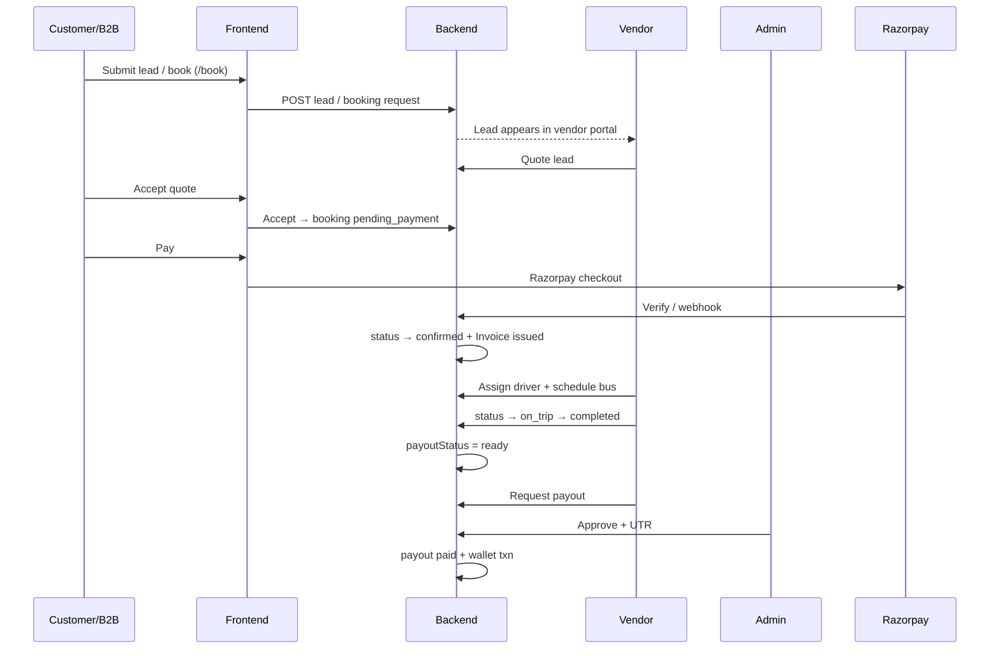
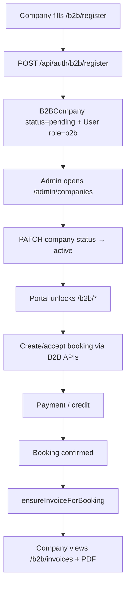
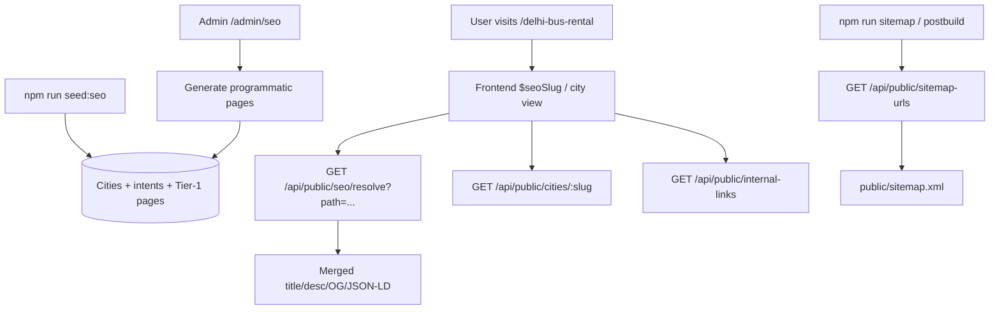
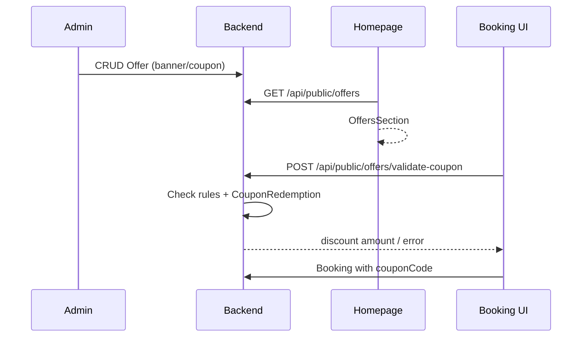

# Features Added Today — Luxury Bus (Frontend + Backend)

**Date:** 4 August 2026  
**Repos:**
- Backend: `luxurybus-backend` → commit `dbf0922`
- Frontend: `gobus-rentals` → commits `2e9536f`, `aa35f7c`

This release turns the marketplace into a full enterprise platform: B2B portal, vendor ops (drivers/calendar/payouts), admin analytics & SEO manager, CMS, offers/coupons, maps fare estimator, PDF invoices/vouchers, and programmatic city SEO.

---

## Table of contents

1. [What shipped (inventory)](#1-what-shipped-inventory)
2. [Architecture overview](#2-architecture-overview)
3. [Master marketplace flow](#3-master-marketplace-flow)
4. [B2B corporate portal](#4-b2b-corporate-portal)
5. [Vendor portal enhancements](#5-vendor-portal-enhancements)
6. [Admin enterprise ops](#6-admin-enterprise-ops)
7. [SEO platform](#7-seo-platform)
8. [Content CMS](#8-content-cms)
9. [Offers & coupon engine](#9-offers--coupon-engine)
10. [Maps & fare estimator](#10-maps--fare-estimator)
11. [PDF invoices & trip vouchers](#11-pdf-invoices--trip-vouchers)
12. [Wishlist, saved trips & notifications](#12-wishlist-saved-trips--notifications)
13. [Auth & onboarding updates](#13-auth--onboarding-updates)
14. [Frontend UX shell](#14-frontend-ux-shell)
15. [Seeds & ops commands](#15-seeds--ops-commands)
16. [Env checklist](#16-env-checklist)

---

## 1. What shipped (inventory)

### Backend (`luxurybus-backend`)

| Area | What was added |
|------|----------------|
| **B2B API** | Company register/approve, employees, bookings/trips, favourites, wallet, contracts, invoices |
| **Vendor ops** | Drivers CRUD, assign-driver, schedule trip, calendar, deep analytics, payout request |
| **Admin ops** | Analytics, global search, audit logs, activity timeline, companies, payouts, offers, SEO manager, CMS |
| **SEO** | Site settings, page meta, redirects, cities, intents, programmatic pages, internal links, sitemap expand |
| **Content** | Vehicle types, service/corporate/industry pages, blogs + taxonomy, FAQs, fleet public API |
| **Offers** | Banner + coupon CMS, public list, coupon validate + redemption |
| **Maps** | Geocode, distance, fare-estimate (Nominatim + rate config) |
| **PDF** | GST invoice PDF, trip voucher PDF (pdfkit) |
| **Lifecycle** | Booking events, search text, auto-invoice on confirm, payout-ready on complete |
| **Enterprise helpers** | Notifications, wishlist, saved-trips under `/api/enterprise` |
| **Security/ops** | Sanitize middleware, structured logger, Mongo backup script, Zod validators |

### Frontend (`gobus-rentals`)

| Area | What was added |
|------|----------------|
| **B2B portal** | `/b2b/*` — register, dashboard, bookings, trips, employees, favourites, wallet, invoices, contracts, payments |
| **Admin panels** | analytics, companies, drivers, calendar, payouts, offers, audit-logs, activity, SEO, services, blogs, FAQs, vehicle-types |
| **Vendor panels** | analytics, drivers, calendar, documents, notifications; richer register/fleet/earnings |
| **Customer** | wishlist, saved-trips |
| **Public SEO** | City hubs, programmatic intent×city pages, service/corporate/industry landings, internal link blocks |
| **Homepage** | Offers section, fleet slider, solutions/corporate sections, Urbania sections |
| **Enterprise UX** | Dark mode, ⌘K global search, notification bell, fare estimator on `/book`, responsive panel shell |
| **API clients** | `src/lib/api/content.ts`, `src/lib/api/seo.ts`, maps/fare via local-api |
| **Mock API** | `mock-api/*` stores for local B2B/content when backend optional |

---

## 2. Architecture overview

```
┌─────────────────────────────────────────────────────────────────┐
│  Frontend (gobus-rentals / Vite + TanStack Router)              │
│  Public site · Customer · Vendor · B2B · Admin panels           │
└────────────────────────────┬────────────────────────────────────┘
                             │  REST + JWT Bearer
                             ▼
┌─────────────────────────────────────────────────────────────────┐
│  Backend (Express MVC)                                          │
│  /api/auth  /api/public  /api/customer  /api/vendor             │
│  /api/b2b   /api/admin   /api/enterprise  /api/payments         │
└────────────────────────────┬────────────────────────────────────┘
                             ▼
┌──────────────┐  ┌──────────────┐  ┌──────────────┐
│   MongoDB    │  │  Razorpay    │  │  SMTP / OSM  │
│  collections │  │  payments    │  │  email/maps  │
└──────────────┘  └──────────────┘  └──────────────┘
```

**Role → shell routes**

| Role | Frontend shell | API prefix |
|------|----------------|------------|
| Customer | `/customer/*` | `/api/customer`, `/api/enterprise` |
| Vendor | `/vendor/*` | `/api/vendor` |
| B2B | `/b2b/*` | `/api/b2b` |
| Admin | `/admin/*` | `/api/admin`, `/api/enterprise` |
| Public | `/`, SEO landings | `/api/public` |

---

## 3. Master marketplace flow

End-to-end trip lifecycle connecting customer/B2B → vendor → payment → trip → payout.



### Status machine

```
pending_payment → confirmed → on_trip → completed
                      │            │          │
                      └─ Invoice auto-created ┘
                                                 └─ payoutStatus = ready
```

**Backend services:** `bookingLifecycle.service.js`, `payment.service.js`, `payout.service.js`, `notify.service.js`  
**Key helpers:**
- `applyBookingStatusChange` — updates status, appends `BookingEvent`, ensures invoice, rebuilds `searchText`
- On `completed` → `payoutStatus = 'ready'` (unless override)

### Frontend touchpoints

| Step | UI |
|------|-----|
| Quote / book | `/book`, BookingForm + FareEstimator |
| Customer track | `/customer/bookings`, `/customer/quotes` |
| Vendor ops | `/vendor/leads`, `/vendor/quotes`, `/vendor/bookings`, `/vendor/drivers`, `/vendor/calendar` |
| Admin monitor | `/admin/bookings`, `/admin/activity`, `/admin/payouts` |

---

## 4. B2B corporate portal

### What it does

Companies register, wait for admin approval, then manage employees, corporate bookings, favourites, wallet/credit, contracts, and GST invoices.

### Models

`B2BCompany`, `B2BEmployee`, `B2BContract`, `Invoice`, `FavouriteVehicle`, `User` (role `b2b`)

### Complete flow — register → approve → book → invoice



### Frontend routes

| Route | Purpose |
|-------|---------|
| `/b2b/register` | Company + contact signup |
| `/customer/b2b-register` | Legacy redirect |
| `/login?role=b2b` | Login |
| `/b2b/dashboard` | KPIs |
| `/b2b/bookings`, `/b2b/trips` | Trip list |
| `/b2b/employees` | Invite/manage staff |
| `/b2b/favourites` | Preferred vehicles |
| `/b2b/wallet`, `/b2b/payments` | Credit + history |
| `/b2b/invoices` | GST invoices |
| `/b2b/contracts` | Pricing agreements (read-only) |

### Backend APIs (`/api/b2b`, role: `b2b`)

| Method | Path | Action |
|--------|------|--------|
| GET | `/dashboard` | Company KPIs |
| GET | `/company` | Company profile |
| GET/POST/PATCH | `/employees`… | Invite & update |
| GET | `/bookings`, `/trips` | Corporate bookings |
| POST | `/quotes/:id/accept` | Accept vendor quote |
| GET/POST/DELETE | `/favourites`… | Vehicle prefs |
| GET | `/wallet`, `/payments` | Credit & payments |
| GET | `/contracts` | Contracts |
| GET | `/invoices`, `/invoices/:id` | Invoices |

Admin company APIs live under `/api/admin/companies*` (approve/reject/suspend, credit, contracts).

### Demo seed

```bash
npm run seed:b2b
# login: active.corp@demo.local / B2Bdemo@123
```

---

## 5. Vendor portal enhancements

### What it does

Vendors manage fleet, drivers, calendar, deep analytics, KYC docs, earnings, and payout requests. Multi-step OTP registration on frontend.

### Models

`Vendor`, `Bus`, `Driver`, `VendorPayout`, `VendorWalletTransaction`, `UserNotification`

### Complete flow — lead → trip → payout

```mermaid
flowchart LR
  L[Lead in /vendor/leads] --> Q[Submit quote]
  Q --> A[Customer/B2B accepts + pays]
  A --> C[Booking confirmed]
  C --> D[POST assign-driver]
  D --> S[POST schedule bus/time]
  S --> T[on_trip → completed]
  T --> R[payoutStatus ready]
  R --> P[POST /api/vendor/payouts]
  P --> AD[Admin approve on /admin/payouts]
  AD --> PAID[UTR + wallet debit]
```



### Frontend routes (new/enhanced)

| Route | Notes |
|-------|-------|
| `/vendor/register` | Multi-step OTP onboarding |
| `/vendor/analytics` | Cards + deep series |
| `/vendor/drivers` | CRUD drivers |
| `/vendor/calendar` | Trip assignments |
| `/vendor/documents` | KYC uploads |
| `/vendor/earnings` | Wallet + payout history |
| `/vendor/notifications` | In-app alerts |
| `/vendor/fleet` | Buses + availability |

### Key backend APIs

| Method | Path | Action |
|--------|------|--------|
| GET/POST/PATCH/DELETE | `/api/vendor/drivers` | Driver CRUD |
| POST | `/api/vendor/bookings/:id/assign-driver` | Assign + notify customer |
| POST | `/api/vendor/bookings/:id/schedule` | Journey date/time + bus |
| GET | `/api/vendor/calendar` | Availability events |
| GET | `/api/vendor/analytics/deep` | Time-series analytics |
| POST | `/api/vendor/payouts` | Request payout for ready bookings |
| GET | `/api/vendor/vouchers/:id/pdf` | Trip voucher PDF |

**Payout statuses:** `pending` → `approved` / `partial` / `rejected` → `paid` (with UTR)

---

## 6. Admin enterprise ops

### What it does

Single control plane for marketplace health: KPIs, charts, global search, audit trail, B2B approval, vendor KYC, offers, payouts, CMS, SEO, notifications.

### Frontend routes (new)

| Route | Capability |
|-------|------------|
| `/admin/analytics` | Revenue / booking / lead / fleet charts (Recharts) |
| `/admin/companies` | Approve/reject/suspend B2B, credit, contracts |
| `/admin/drivers` | Cross-vendor driver directory |
| `/admin/calendar` | Global trip schedule |
| `/admin/payouts` | Approve/reject/partial + UTR + CSV |
| `/admin/offers` | Banner + coupon CMS |
| `/admin/audit-logs` | Security/action trail |
| `/admin/activity` | Booking event timeline |
| `/admin/seo` | Full SEO manager |
| `/admin/services`, `/admin/blogs`, `/admin/faqs`, `/admin/vehicle-types` | CMS |
| `/admin/blog-categories`, `/admin/blog-tags` | Blog taxonomy |

### Global tools (panel chrome)

- **⌘K / Ctrl+K** → `GlobalSearch` → `GET /api/enterprise/search`
- **Notification bell** → in-app notifications
- **Theme toggle** → dark/light (`lbr_theme`)

### Backend APIs (highlights)

| Method | Path | Action |
|--------|------|--------|
| GET | `/api/enterprise/analytics` | Admin analytics payload |
| GET | `/api/enterprise/search?q=` | Global search |
| GET | `/api/enterprise/audit-logs` | Audit trail |
| GET | `/api/enterprise/activity` | Booking events |
| GET | `/api/enterprise/drivers` | All drivers |
| GET | `/api/enterprise/calendar` | Fleet calendar |
| * | `/api/admin/seo/*` | SEO CRUD + generate |
| * | `/api/admin/offers*` | Offers CMS |
| * | `/api/admin/payouts*` | Payout processing |

**Models:** `AuditLog`, `BookingEvent`, `Offer`, `VendorPayout`, SEO models, content models

---

## 7. SEO platform

### What it does

Programmatic SEO at scale: 500+ city hubs, intent×city pages, admin-editable meta/robots/tracking, redirects, internal linking, expanded sitemap feed.

### Models

`SeoSiteSettings`, `SeoPageMeta`, `SeoRedirect`, `SeoLocation`, `SeoIntent`, `ProgrammaticSeoPage`, `ContentPage`, `ContentTemplate`

### Complete flow — seed → resolve → render → sitemap



### Public APIs

| Method | Path | Purpose |
|--------|------|---------|
| GET | `/api/public/seo/site` | Sitewide SEO + GA/GTM/pixel |
| GET | `/api/public/seo/resolve?path=` | Merged meta for a path |
| GET | `/api/public/seo/robots.txt` | Robots body |
| GET | `/api/public/cities`, `/cities/:slug` | City hubs |
| GET | `/api/public/seo-pages/:slug` | Intent×city page |
| GET | `/api/public/internal-links`, `/nav-links` | Link engine |
| GET | `/api/public/sitemap-urls` | Expanded URL feed |

### Frontend surfaces

| Route pattern | Component |
|---------------|-----------|
| `/{city}-bus-rental` | `CitySeoLandingView` |
| `/{intent}-{city}` | Programmatic via `$seoSlug` |
| `/services/$serviceSlug`, `/corporate/$slug`, `/industries/$slug` | Service landings + internal links |
| `/admin/seo` | SEO Manager UI |
| Homepage | Lazy SEO sections + offers/fleet |

**Internal linking engine** (`internalLink.service.js`): related/nearby cities, vehicles, industries, blogs, FAQs, trending, popular.

---

## 8. Content CMS

### What it does

Admin-managed vehicle types, service/corporate/industry pages, blogs (with categories/tags/authors), FAQs, and public fleet — consumed by marketing pages and homepage.

### Flow

```
Admin CMS UI → /api/admin/* content endpoints → Mongo models
                                              ↓
Public pages ← GET /api/public/vehicle-types|services|blogs|faqs|fleet
```

### Public content APIs

| Path | Used by |
|------|---------|
| `/api/public/vehicle-types` | Booking form, vehicle pages |
| `/api/public/services`, `/services/:slug` | Service landings |
| `/api/public/blogs`, `/blogs/:slug` | Blog index + post |
| `/api/public/blog-categories`, `/blog-tags` | Filters |
| `/api/public/faqs` | FAQ sections |
| `/api/public/fleet` | Fleet slider |
| `/api/public/reviews/featured` | Social proof |

**Seed:** `npm run seed:platform` — vehicle types, corporate/industry/service pages, blogs, FAQs.

---

## 9. Offers & coupon engine

### What it does

Admin creates banners and coupons; homepage shows active offers; booking validates coupon before payment.

### Flow



### UI

- Admin: `/admin/offers`
- Public: homepage `OffersSection`
- Booking: coupon field + validate

**Models:** `Offer`, `CouponRedemption`  
**Service:** `offer.service.js`  
**Seed coupon example:** `CORP10` (via B2B seed)

---

## 10. Maps & fare estimator

### What it does

Live distance via OpenStreetMap Nominatim + configured per-km/day rates → GST-inclusive fare estimate on `/book`.

### Flow

```
User enters origin + destination on /book
        ↓
FareEstimator → POST /api/public/maps/fare-estimate
        ↓
maps.service: geocode → distance → rate × km/days + GST
        ↓
UI shows estimated total
```

### APIs

| Method | Path |
|--------|------|
| GET | `/api/public/maps/geocode?q=` |
| GET/POST | `/api/public/maps/distance` |
| POST | `/api/public/maps/fare-estimate` |

Same maps endpoints also under `/api/enterprise/maps/*`.

**Frontend:** `src/components/enterprise/FareEstimator.tsx` on `/book`.

---

## 11. PDF invoices & trip vouchers

### What it does

GST invoices auto-issue when booking reaches `confirmed` / `on_trip` / `completed`. Trip vouchers PDF for customer/vendor/admin download.

### Flow

```
Booking status → confirmed+
        ↓
ensureInvoiceForBooking() → Invoice number LBR-INV-YYYY-######
        ↓
GET /api/enterprise/invoices/:id/pdf  → pdfkit stream
GET /api/enterprise/vouchers/:id/pdf  → trip voucher
```

Also mounted for vendor (`/api/vendor/vouchers/:id/pdf`) and admin.

**Service:** `pdf.service.js`  
**UI:** B2B invoices page, booking detail download actions

---

## 12. Wishlist, saved trips & notifications

### Customer / B2B

| Feature | Frontend | API |
|---------|----------|-----|
| Wishlist | `/customer/wishlist` | `/api/enterprise/wishlist` |
| Saved trips | `/customer/saved-trips` | `/api/enterprise/saved-trips` |
| Favourites (B2B) | `/b2b/favourites` | `/api/b2b/favourites` |

### Notifications

```
Domain event (assign driver, payout, status…)
        ↓
notify.service → UserNotification (+ optional SMTP)
        ↓
NotificationBell polls GET /api/enterprise/notifications
        ↓
Mark read / read-all
```

Admin can also broadcast email from `/admin/notifications`.

**Models:** `Wishlist`, `SavedTrip`, `UserNotification`, `NotificationLog`

---

## 13. Auth & onboarding updates

| Flow | Frontend | Backend |
|------|----------|---------|
| Customer register/login | `/login`, register | `/api/auth/register`, `/login` |
| Google login | Login UI | `POST /api/auth/google` |
| Vendor register + OTP | `/vendor/register` multi-step | `/api/auth/vendor/register`, `/otp/send`, `/otp/verify` |
| B2B register | `/b2b/register` | `POST /api/auth/b2b/register` |
| Role login | `/login?role=admin\|vendor\|b2b\|customer` | JWT + `requireRole` |

**Models:** `User`, `Otp`, `Vendor`, `B2BCompany`

---

## 14. Frontend UX shell

Shipped in panel chrome (`ResponsivePanelLayout`, enterprise components):

| Feature | Component / storage |
|---------|---------------------|
| Dark mode | `ThemeToggle`, `lbr_theme` |
| Global search (admin) | `GlobalSearch` (cmdk) |
| Notification bell | `NotificationBell` |
| Mobile nav sheet | Responsive panel layout |
| Fare estimator | `FareEstimator` on `/book` |
| Nav link maps | `panel-links.ts` (admin/vendor/b2b/customer) |

**Perf:** React Query caching for dashboards/notifications; backend TTL cache for public content/fare; Recharts `ResponsiveContainer` on analytics.

---

## 15. Seeds & ops commands

### Backend

```bash
cp .env.example .env
npm install
npm run dev

npm run seed:admin      # admin user
npm run seed:platform   # vehicle types, services, blogs, FAQs
npm run seed:b2b        # demo corporate account
npm run seed:seo        # cities, intents, programmatic pages
npm run backup:db       # mongodump wrapper
```

### Frontend

```bash
# set VITE_API_URL + VITE_SITE_URL
npm install
npm run dev
npm run sitemap         # regenerate sitemap (also postbuild)
```

---

## 16. Env checklist

### Backend (`.env.example`)

| Variable | Used for |
|----------|----------|
| `MONGODB_URI` | Database |
| `JWT_SECRET` | Auth |
| `CLIENT_ORIGIN` | CORS allowlist (prod) |
| `SMTP_*` | OTP + notification email |
| `RAZORPAY_*` | Payments |
| `CLOUDINARY_*` | Image uploads |
| Fare rate vars | Maps fare estimator |

### Frontend (`.env.example`)

| Variable | Used for |
|----------|----------|
| `VITE_API_URL` | Authenticated + public API base |
| `VITE_SITE_URL` | Canonical / sitemap (`https://www.luxurybusrental.in`) |

---

## Quick reference — new frontend routes

### Admin
`/admin/analytics` · `/admin/companies` · `/admin/drivers` · `/admin/calendar` · `/admin/payouts` · `/admin/offers` · `/admin/audit-logs` · `/admin/activity` · `/admin/seo` · `/admin/services` · `/admin/blogs` · `/admin/blog-categories` · `/admin/blog-tags` · `/admin/vehicle-types` · `/admin/faqs`

### Vendor
`/vendor/analytics` · `/vendor/drivers` · `/vendor/calendar` · `/vendor/documents` · `/vendor/notifications`

### B2B
`/b2b/register` · `/b2b/dashboard` · `/b2b/bookings` · `/b2b/trips` · `/b2b/employees` · `/b2b/favourites` · `/b2b/wallet` · `/b2b/invoices` · `/b2b/contracts` · `/b2b/payments`

### Customer
`/customer/wishlist` · `/customer/saved-trips`

### Public / SEO
City hubs · programmatic intent×city · `/corporate/*` · `/industries/*` · enhanced `/services/*` · `/blog/*`

---

## Related docs

| Doc | Scope |
|-----|-------|
| [API.md](./API.md) | Endpoint map |
| [ADMIN.md](./ADMIN.md) | Admin portal |
| [VENDOR.md](./VENDOR.md) | Vendor portal |
| [B2B.md](./B2B.md) | B2B portal |
| [SEO.md](./SEO.md) | SEO APIs & seed |
| Frontend `gobus-rentals/docs/ENTERPRISE.md` | FE UX notes |
| Frontend `gobus-rentals/docs/SEO_AUDIT.md` | SEO checklist |

---

*Generated for the 4 Aug 2026 enterprise release (frontend `gobus-rentals` + backend `luxurybus-backend`).*
