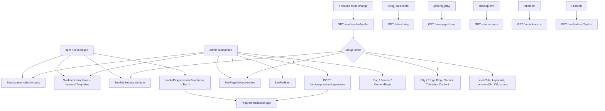

# SEO Platform — Complete Documentation

Backend SEO system for Luxury Bus Rental India. Manages site defaults, path-level meta overrides, city hubs, intent×city programmatic pages, keywords, redirects, robots, sitemap URL feeds, and internal links.

There is **no separate Keyword collection** and **no Semrush/rank tracker**. Keywords are `string[]` fields on entities, plus **keyword templates** on intents/content templates that expand with tokens (`{City}`, `{Intent}`, etc.).

---

## Architecture overview

```
┌─────────────────────────────────────────────────────────────────┐
│  ADMIN (JWT)  /api/admin/seo/*                                  │
│  Site settings · Page meta · Redirects · Locations · Intents    │
│  Programmatic generate · Templates · Content pages · Orphans    │
└────────────────────────────┬────────────────────────────────────┘
                             │ writes MongoDB
                             ▼
┌─────────────────────────────────────────────────────────────────┐
│  Mongo models                                                   │
│  SeoSiteSettings · SeoPageMeta · SeoRedirect · SeoLocation      │
│  SeoIntent · ProgrammaticSeoPage · ContentTemplate/ContentPage  │
│  BlogPost / ServicePage / VehicleType (entity SEO fields)       │
└────────────────────────────┬────────────────────────────────────┘
                             │ reads
                             ▼
┌─────────────────────────────────────────────────────────────────┐
│  PUBLIC  /api/public/*                                          │
│  resolve · site · robots · cities · seo-pages · redirects       │
│  internal-links · nav-links · sitemap-urls · content            │
└────────────────────────────┬────────────────────────────────────┘
                             │
                             ▼
┌─────────────────────────────────────────────────────────────────┐
│  FRONTEND                                                       │
│  Apply <title>/meta/OG · city & programmatic routes             │
│  Build sitemap.xml from feed · proxy robots.txt · redirects     │
│  Admin UI: /admin/seo                                           │
└─────────────────────────────────────────────────────────────────┘
```

### Key files

| Layer | Path |
|-------|------|
| Docs | `docs/SEO.md` |
| Service | `src/services/seo.service.js` |
| Internal links | `src/services/internalLink.service.js` |
| Controller | `src/controllers/seo.controller.js` |
| Public routes | `src/routes/public.routes.js` |
| Admin routes | `src/routes/admin.routes.js` |
| Seed | `scripts/seedSeoPlatform.js` |
| Cities JSON | `scripts/data/indiaCitiesFromFrontend.json` |
| Tokens | `src/utils/contentTokens.js` |
| Cache | `src/utils/cache.js` |

### npm scripts

```bash
npm run seed:seo      # seed cities, intents, Tier-1 programmatic pages, redirects, templates
npm run seo:generate  # same script alias
```

---

## End-to-end flow



### Resolve precedence (`resolveSeoForPath`)

For any path:

1. **Active `SeoPageMeta` override** (if `status: active`) — wins for title, description, keywords, robots, OG, etc.
2. Else **entity meta** from `findEntityMeta(path)` (city, programmatic, content page, blog, service, vehicle).
3. Else **site defaults** from `SeoSiteSettings`.

Keywords specifically:

```
override.keywords (if non-empty)
  → else entity.keywords (if non-empty)
  → else site.defaultKeywords
```

Result is **cached 5 minutes** (`seo:resolve:{path}`).

Canonical URL = `canonicalHost` + `canonicalPath`.

---

## Keywords system

Keywords are **not** a standalone entity. They live as arrays and templates:

| Source | Where stored | How produced |
|--------|--------------|--------------|
| Site defaults | `SeoSiteSettings.defaultKeywords` | Seeded / admin PATCH |
| Path override | `SeoPageMeta.keywords` | Admin upsert by `path` |
| City hub | `SeoLocation.keywords` | `enrichCityDefaults` or admin | Example: `bus rental Delhi`, `Delhi luxury bus`, … |
| Intent templates | `SeoIntent.keywordTemplates` | Tokens → programmatic page | Default: `['{Intent} {City}', '{Intent} in {City}', 'bus rental {City}']` |
| Programmatic page | `ProgrammaticSeoPage.keywords` | Generated at upsert/generate time |
| Content template | `ContentTemplate.keywordTemplates` | Applied on content-page upsert unless `seoLocked` |
| Content page | `ContentPage.keywords` | From template or manual |
| Blog / Service | `keywords[]` on models | Admin CMS create/update |
| Vehicle | synthesized at resolve | `[name, "{slug} rental"]` |

### Token vocabulary (intents / templates)

| Token | Meaning |
|-------|---------|
| `{Intent}` | Intent display name |
| `{City}` | Location name |
| `{State}` | State or `India` |
| `{Vehicle}` | `vehicleTypeSlug` or intent name |
| `{Service}` | `servicePageSlug` or intent name |
| `{Title}` / `{Description}` | Content template tokens |

Applied via `applyTokens()` in `src/utils/contentTokens.js`.

### City default keywords (`enrichCityDefaults`)

If a city has no keywords:

```
bus rental {City}
{City} luxury bus
corporate bus {City}
urbania rental {City}
```

Plus auto meta title/description, FAQs, industries, related services, pricing hints, canonical `/{slug}-bus-rental`.

### Programmatic keyword generation

`renderProgrammaticFromIntent(intent, location)`:

1. Build tokens from intent + city.
2. Expand `intent.keywordTemplates` (or fallbacks).
3. Write `metaTitle`, `metaDescription`, `keywords`, body, FAQs onto `ProgrammaticSeoPage`.
4. Slug / path: `/{intentSlug}-{locationSlug}` (e.g. `/corporate-bus-rental-delhi`).

Seed generates **all active intents × all Tier-1 cities**. Admin can regenerate with higher `maxTier`:

```http
POST /api/admin/seo/programmatic/generate
Authorization: Bearer <admin>
{ "maxTier": 2 }
```

---

## Data models

### `SeoSiteSettings` (singleton `key: 'default'`)

- Host / branding: `canonicalHost`, `siteName`, `twitterHandle`
- Defaults: `defaultMetaTitle`, `defaultMetaDescription`, `defaultKeywords[]`, `defaultOgImage`, `defaultTwitterCard`, `defaultRobots`
- Sitemap: `sitemapEnabled`, `defaultChangefreq`, `defaultPriority`
- Robots body: `robotsTxtBody`
- Tracking: Google/Bing/Facebook verification, GA, GTM, Pixel, `conversionLabels`
- 404 copy + robots
- Schema flags stored: `enableOrganization`, `enableWebsite`, `organizationJson` (**not yet returned by public site SEO / no JSON-LD builder**)

### `SeoPageMeta`

Per-path override: `path` (unique), meta fields, `keywords[]`, OG/Twitter, `robots`, `schemaOverrides`, `priority`, `changefreq`, `indexStatus` (`index|noindex|blocked`), `status` (`active|draft`).

### `SeoLocation`

Types: `city | airport | destination | state | country`.

City hubs use `canonicalPath` like `/{slug}-bus-rental`. Rich content: FAQs, routes, industries, nearby cities/airports, pricing, testimonials. SEO: `metaTitle`, `metaDescription`, `keywords`, `ogImage`, `robots`.

Tier `1|2|3` controls programmatic generation priority.

### `SeoIntent`

Template for one search intent (22 seeded). Fields: `titleTemplate`, `h1Template`, `descriptionTemplate`, **`keywordTemplates[]`**, `bodyTemplate`, `faqTemplates`, `schemaType`, `minTier`, links to `servicePageSlug` / `vehicleTypeSlug`.

### `ProgrammaticSeoPage`

Materialized intent × location page. Unique on `(intentSlug, locationSlug)` and on `slug` / `canonicalPath`. Status: `draft|published|noindex|archived`.

### `SeoRedirect`

`fromPath` → `toPath`, `statusCode` `301|302|410`, `enabled`, `hits` (incremented on public match).

### CMS entities with SEO

- **BlogPost** / **ServicePage**: meta + keywords + canonical + ogImage + robots
- **ContentTemplate** / **ContentPage**: template-driven SEO; `seoLocked` freezes auto keyword/title fill
- **VehicleType**: no stored meta; resolve synthesizes title/keywords from name/slug

---

## Public APIs (`/api/public`)

No auth.

| Method | Path | Purpose |
|--------|------|---------|
| GET | `/seo/site` | Sanitized site defaults + tracking IDs |
| GET | `/seo/resolve?path=` | Merged meta for a path (primary FE hook) |
| GET | `/seo/robots.txt` | Plain-text robots body |
| GET | `/seo/redirects` | Enabled redirects list |
| GET | `/seo/redirect?path=` | Match one redirect; increments `hits` |
| GET | `/cities?tier=` | City list (`slug`, `name`, `stateName`, `tier`) |
| GET | `/cities/:slug` | City hub + `seo` + `internalLinks` + nearby |
| GET | `/seo-pages/:slug` | Programmatic page + `seo` + `internalLinks` |
| GET | `/internal-links` | Link clusters (`pageType`, `slug`, `citySlug`, …) |
| GET | `/nav-links` | Header/footer/trending nav payload |
| GET | `/content/by-path?path=` | Content page + seo + links |
| GET | `/content/:type/:slug` | Same by type/slug |
| GET | `/sitemap-urls` | `{ urls: [{path,changefreq,priority}], host }` JSON feed |

### Resolve response shape

```json
{
  "path": "/delhi-bus-rental",
  "metaTitle": "...",
  "metaDescription": "...",
  "keywords": ["bus rental Delhi", "..."],
  "canonicalPath": "/delhi-bus-rental",
  "canonicalUrl": "https://www.luxurybusrental.in/delhi-bus-rental",
  "robots": "index,follow",
  "ogTitle": "...",
  "ogDescription": "...",
  "ogImage": "...",
  "twitterTitle": "...",
  "twitterDescription": "...",
  "twitterImage": "...",
  "twitterCard": "summary_large_image",
  "siteName": "Luxury Bus Rental",
  "twitterHandle": "@LuxuryBusRental",
  "priority": 0.8,
  "changefreq": "weekly",
  "indexStatus": "index",
  "entityType": "city"
}
```

### Entity path patterns (resolve matching)

| Pattern | Entity |
|---------|--------|
| `/{slug}-bus-rental` | City hub |
| Exact `ProgrammaticSeoPage.canonicalPath` | Programmatic |
| Exact `ContentPage.path` | Content page |
| `/blog/{slug}` | Blog |
| `/services|corporate|industries/{slug}` | ServicePage |
| `/{slug}-rental` (not `-bus-rental`) | VehicleType |

---

## Admin APIs (`/api/admin`)

Requires auth + admin role. Frontend: **`/admin/seo`**.

| Method | Path | Notes |
|--------|------|-------|
| GET/PATCH | `/seo/site` | Full site settings |
| GET/POST | `/seo/pages` | List / upsert page meta by `path` |
| DELETE | `/seo/pages/:id` | |
| GET/POST | `/seo/redirects` | Upsert needs `fromPath`, `toPath` |
| DELETE | `/seo/redirects/:id` | |
| GET | `/seo/orphans` | Orphan URL audit |
| GET/POST | `/seo/locations` | Upsert city/airport; auto-enrich cities |
| GET/POST | `/seo/intents` | Upsert intent (incl. `keywordTemplates`) |
| GET | `/seo/programmatic` | List (limit 500) |
| POST | `/seo/programmatic/generate` | `{ maxTier? }` → upsert intent×city |
| GET/POST | `/seo/templates` | Content templates |
| GET/POST | `/seo/content-pages` | Template-driven pages |
| GET/POST | `/blog-authors` | Authors |
| POST | `/blogs/:id/rebuild-toc` | Rebuild TOC from HTML |

Blog/service/vehicle admin CRUD also accept SEO fields via content validators.

---

## Seed pipeline (`npm run seed:seo`)

1. Upsert `SeoSiteSettings` (host `https://www.luxurybusrental.in`).
2. Upsert blog author + content templates (`premium-service`, `city-hub`) with `keywordTemplates`.
3. Bulk import cities from `indiaCitiesFromFrontend.json` as **tier 3**.
4. Extra cities → **tier 2**; priority list → **tier 1** (wins on re-run).
5. Each city runs `enrichCityDefaults` (meta + keywords + FAQs + …).
6. Seed airports with `/airports/{slug}` canonicals.
7. Seed **22 intents** with keyword/title/FAQ templates.
8. Seed a few **301 redirects**.
9. Generate programmatic pages for **every active intent × every Tier-1 city**.

---

## Sitemap & robots

- **Robots**: stored in DB (`robotsTxtBody`), served as text at `/api/public/seo/robots.txt`. Not a static file in this repo.
- **Sitemap**: backend returns a **JSON URL feed** (`/api/public/sitemap-urls`). Frontend/ops should build `sitemap.xml`.

Feed includes:

- Static hubs (`/`, `/book`, `/blog`, …)
- Published cities
- Published services / corporate / industries
- Published blogs
- Published programmatic pages
- Active vehicles (`/{slug}-rental`)
- Published content pages  
Respects `SeoPageMeta` `noindex` / `blocked` where applicable.

---

## Internal linking

`buildInternalLinks` (cached **1 hour**) returns clusters:

`relatedCities`, `nearbyCities`, `relatedVehicles`, `relatedIndustries`, `relatedBlogs`, `relatedServices`, `relatedFaqs`, `popularSearches`, `latestBlogs`, `mostBookedVehicles`, `topRoutes`, `trendingCities`, `footerLinks`, `headerLinks`, `breadcrumbs`.

Anchor text uses rotating variants (`anchorVariant`) for keyword diversity.

City pages and programmatic pages attach `internalLinks` automatically.

---

## Frontend integration checklist

1. On route change → `GET /api/public/seo/resolve?path=<pathname>` → set `<title>`, meta description, keywords, canonical, OG, Twitter, robots.
2. Boot → `GET /api/public/seo/site` → verification / GA / GTM / default OG image.
3. City route `/{slug}-bus-rental` → `GET /api/public/cities/:slug`.
4. Programmatic route → `GET /api/public/seo-pages/:slug`.
5. Middleware → `GET /api/public/seo/redirect?path=` for 301/302.
6. Serve `/robots.txt` from `/api/public/seo/robots.txt`.
7. Build `/sitemap.xml` from `/api/public/sitemap-urls`.
8. Admin UI at `/admin/seo` wired to `/api/admin/seo/*`.
9. JSON-LD: build client-side if needed (backend stores schema hints but does **not** emit JSON-LD today).

---

## Caching

| Key pattern | TTL |
|-------------|-----|
| `seo:resolve:{path}` | 5 minutes |
| `links:{pageType}:{slug\|path}` | 1 hour |

No explicit invalidation on admin writes — updates appear after TTL.

---

## Env / jobs

- **No SEO-specific env vars.** Host, robots, tracking live in `SeoSiteSettings`. Uses normal `MONGODB_URI`.
- **No cron.** Programmatic regen is manual (`seed:seo` or admin generate). Blog scheduled publish runs on-demand when listing/sitemap, not a SEO cron.

---

## Seeded intents (22)

Corporate / mobility: `corporate-bus-rental`, `employee-transportation`, `corporate-fleet`, `corporate-mobility`, `executive-travel`, `vip-transportation`

Services / vehicles: `airport-transfers`, `luxury-bus-rental`, `urbania-rental`, `cab-rental`, `tempo-traveller-rental`

Industries: `government-transportation`, `factory-transportation`, `industrial-transportation`, `school-transportation`, `hospital-transportation`, `mining-transportation`, `oil-gas-transportation`, `airport-crew-transportation`, `foreign-delegates-transportation`, `hotel-transportation`, `tourist-transportation`

Example live URL: `/employee-transportation-delhi` → keywords like `Employee Transportation Delhi`, `Employee Transportation in Delhi`, `bus rental Delhi`.

---

## Known gaps

| Gap | Detail |
|-----|--------|
| JSON-LD | Schema fields exist; API does not assemble schema.org JSON-LD |
| Public site payload | Omits `organizationJson` / schema enable flags |
| No SEO Zod validators | Admin SEO bodies mostly ad-hoc |
| Cache invalidation | Stale resolve/links until TTL |
| Airport resolve | Airports seeded; path matching weaker than cities/programmatic |
| Bus fleet | Individual buses have no SEO model |
| Keyword research | Curated arrays only — no rank / Semrush pipeline |

---

## Quick start

```bash
# 1. Seed the platform
npm run seed:seo

# 2. Public smoke checks
curl "http://localhost:PORT/api/public/seo/site"
curl "http://localhost:PORT/api/public/seo/resolve?path=/delhi-bus-rental"
curl "http://localhost:PORT/api/public/cities/delhi"
curl "http://localhost:PORT/api/public/seo-pages/corporate-bus-rental-delhi"
curl "http://localhost:PORT/api/public/sitemap-urls"
curl "http://localhost:PORT/api/public/seo/robots.txt"

# 3. Expand programmatic beyond Tier-1 (admin token)
curl -X POST "http://localhost:PORT/api/admin/seo/programmatic/generate" \
  -H "Authorization: Bearer ADMIN_JWT" \
  -H "Content-Type: application/json" \
  -d '{"maxTier":2}'
```
