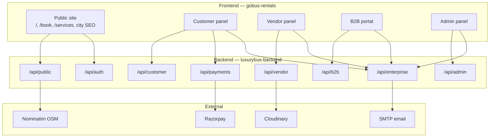
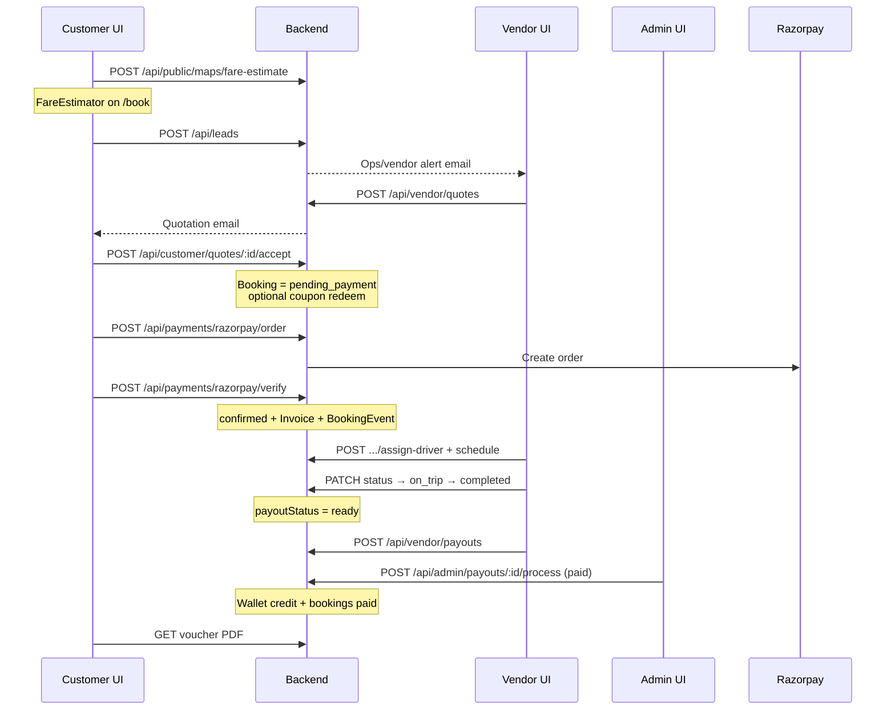
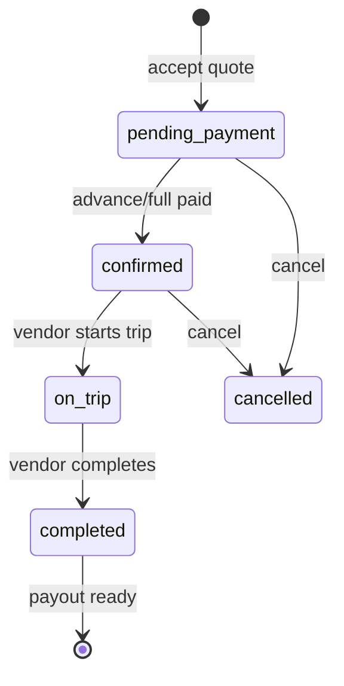
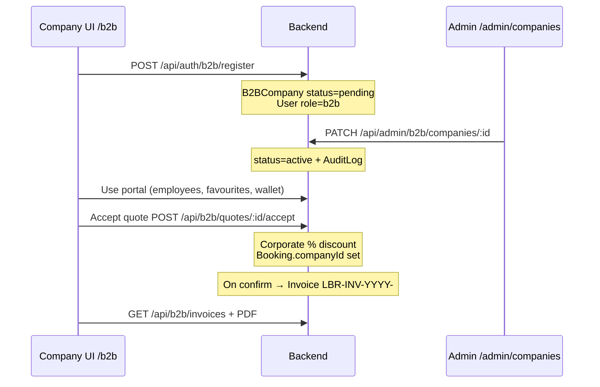
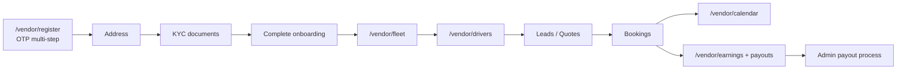
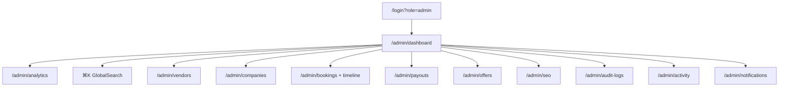
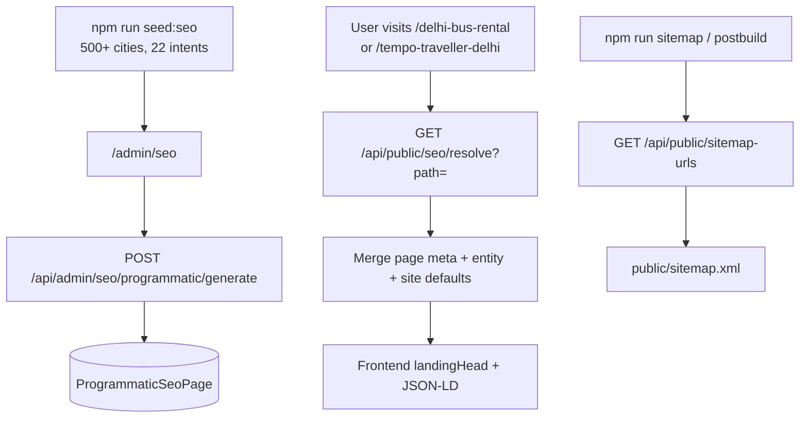
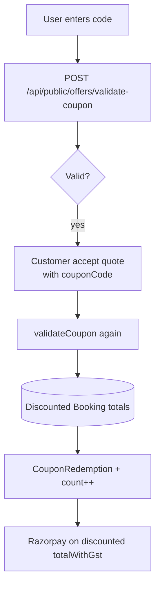

# Luxury Bus — Feature Documentation (4 Aug 2026)

**What shipped today:** Full enterprise layer across **backend** (`luxurybus-backend`) and **frontend** (`gobus-rentals`) — B2B portal, vendor ops, admin analytics/search/audit, SEO platform, offers/coupons, maps/fare, PDF invoices/vouchers, notifications, wishlist/saved trips, and booking lifecycle.

| Repo | Commit | Scope |
|------|--------|-------|
| `luxurybus-backend` | `dbf0922` | Models, services, routes, seeds, portal docs |
| `gobus-rentals` | `2e9536f` (+ `aa35f7c` SEO audit) | Admin/Vendor/B2B/Customer UI, SEO landings, enterprise chrome |

**Stack:** Express + MongoDB/Mongoose + JWT roles · React (TanStack Router) + Vite · Razorpay · Cloudinary · SMTP · Nominatim · PDFKit

**Roles:** `customer` · `vendor` · `b2b` · `admin`

---

## Table of contents

1. [Architecture overview](#1-architecture-overview)
2. [Feature inventory](#2-feature-inventory)
3. [Complete end-to-end flows](#3-complete-end-to-end-flows)
4. [Portal-by-portal feature detail](#4-portal-by-portal-feature-detail)
5. [SEO platform (full flow)](#5-seo-platform-full-flow)
6. [Offers, maps, PDF, notifications](#6-offers-maps-pdf-notifications)
7. [Frontend routes map](#7-frontend-routes-map)
8. [Backend API mounts](#8-backend-api-mounts)
9. [Seeds & ops](#9-seeds--ops)
10. [Status reference](#10-status-reference)

---

## 1. Architecture overview



### API mounts (`src/app.js`)

| Mount | Purpose |
|-------|---------|
| `GET /health` | Health check |
| `/api/auth` | Register/login/OTP/Google/B2B/vendor |
| `/api/leads` | Public/auth lead create |
| `/api/customer` | Customer dashboard + bookings |
| `/api/vendor` | Vendor ops + enterprise extras |
| `/api/b2b` | Corporate portal |
| `/api/admin` | Admin + analytics/search/SEO extras |
| `/api/enterprise` | Cross-role: notifications, wishlist, maps, PDFs |
| `/api/public` | Offers, CMS, SEO, maps, sitemap |
| `/api/payments` | Razorpay order/verify/webhook |

---

## 2. Feature inventory

| # | Feature | Backend | Frontend |
|---|---------|---------|----------|
| A | Customer booking lifecycle | Leads → quotes → accept → Razorpay → trip → voucher | `/book`, customer quotes/bookings, FareEstimator |
| B | Vendor portal ops | Onboarding, fleet, drivers, schedule, calendar, payouts, deep analytics | `/vendor/*` |
| C | B2B corporate portal | Register, approve, employees, favourites, wallet, contracts, invoices | `/b2b/*`, `/b2b/register` |
| D | Admin control center | Analytics, ⌘K search, audit, activity, companies, payouts, offers, SEO | `/admin/*` |
| E | SEO platform | Cities, intents, programmatic pages, resolve, sitemap, robots | `/admin/seo`, `/$seoSlug`, city landings |
| F | Offers & coupons | Banner + coupon engine + redemptions | Homepage OffersSection, `/admin/offers` |
| G | Maps & fare | Geocode, distance, fare-estimate (GST) | FareEstimator on `/book` |
| H | PDF docs | GST invoice + trip voucher (PDFKit) | Download buttons in panels |
| I | Notifications | In-app + SMTP + admin broadcast | NotificationBell, `/admin/notifications` |
| J | Wishlist / saved trips | CRUD + auto distance | `/customer/wishlist`, `/customer/saved-trips` |
| K | Content CMS | Vehicle types, services, blogs, FAQs | Admin CMS routes + public pages |
| L | UX chrome | — | Dark mode, responsive panel, GlobalSearch |

---

## 3. Complete end-to-end flows

### 3.1 Customer trip: lead → quote → pay → trip → payout

This is the core marketplace loop.



**Step-by-step**

1. **Estimate fare (optional)**  
   UI: `/book` → `FareEstimator`  
   API: `POST /api/public/maps/fare-estimate` (geocode + haversine + env rates + 18% GST)

2. **Create lead**  
   API: `POST /api/leads`  
   Creates `Lead`; emails ops (`BOOKING_ALERT_EMAIL`).

3. **Vendor quotes**  
   Vendor UI: `/vendor` leads → `POST /api/vendor/quotes`  
   Creates `Quote`; emails customer.

4. **Customer accepts**  
   API: `POST /api/customer/quotes/:id/accept`  
   Body may include `couponCode`, `paymentType` (`advance` | `full`), `policyAccepted`.  
   Creates `Booking` with `rawStatus: pending_payment`, commission/payout amounts, advance required (~30% unless full).

5. **Pay**  
   - `POST /api/payments/razorpay/order`  
   - Checkout UI  
   - `POST /api/payments/razorpay/verify` (or webhook)  
   When `amountPaid >= advanceRequired` → `confirmed` → `ensureInvoiceForBooking` → `BookingEvent`.

6. **Operate trip**  
   Vendor assigns driver (`POST .../assign-driver`) → customer notified.  
   Schedule journey (`POST .../schedule`).  
   Status: `confirmed` → `on_trip` → `completed`.  
   On complete → `payoutStatus: ready`.

7. **Payout**  
   Vendor: `POST /api/vendor/payouts`  
   Admin: `/admin/payouts` → `POST /api/admin/payouts/:id/process` `{ action: "paid", transactionId }`  
   Credits `VendorWalletTransaction`; marks bookings paid.

8. **Docs**  
   Trip voucher / GST invoice PDFs via enterprise or role-scoped routes.

**Booking state machine**



---

### 3.2 B2B: register → admin approve → book → invoice



**Frontend**

| Step | Route |
|------|-------|
| Register | `/b2b/register` (legacy redirect: `/customer/b2b-register`) |
| Login | `/login?role=b2b` |
| Portal | `/b2b/dashboard`, `/bookings`, `/trips`, `/employees`, `/favourites`, `/wallet`, `/payments`, `/invoices`, `/contracts` |
| Admin approve | `/admin/companies` |

**Demo (after `npm run seed:b2b`):** `active.corp@demo.local` / `B2Bdemo@123`

**Company status:** `pending` → `active` | `rejected` | `suspended`  
Active company required for invites and quote accept (`assertActiveCompany`).

**Note:** Razorpay payment routes are currently **customer-role**. B2B bookings are created as `pending_payment`; corporate discount comes from company/contract settings. Public coupon engine exists; B2B accept primarily applies company `%` discount.

---

### 3.3 Vendor onboarding → fleet → drivers → earnings



**Key APIs**

| Action | API |
|--------|-----|
| Onboarding address | `PATCH /api/vendor/onboarding/address` |
| Upload KYC doc | `POST /api/vendor/onboarding/documents/:docKey` |
| Complete | `POST /api/vendor/onboarding/complete` |
| Drivers CRUD | `/api/vendor/drivers` |
| Assign driver | `POST /api/vendor/bookings/:id/assign-driver` |
| Schedule | `POST /api/vendor/bookings/:id/schedule` |
| Calendar | `GET /api/vendor/calendar` |
| Deep analytics | `GET /api/vendor/analytics/deep` |
| Request payout | `POST /api/vendor/payouts` |
| Voucher PDF | `GET /api/vendor/vouchers/:id/pdf` |

---

### 3.4 Admin ops loop



**Global search flow:** Admin presses ⌘K/Ctrl+K → `GlobalSearch` → `GET /api/admin/search?q=` → regex across bookings (`searchText`), users, vendors, leads, companies, buses, invoices, drivers, offers.

**Analytics flow:** `/admin/analytics` → `GET /api/admin/analytics` (cached ~60s) → revenue/booking/lead series, top vendors, fleet mix (Recharts).

---

### 3.5 SEO: seed → generate → resolve → sitemap → SERP



See [§5](#5-seo-platform-full-flow) for full detail.

---

### 3.6 Coupon at booking



Coupons apply at **quote accept**, not inside Razorpay verify. Payment uses the already-discounted booking amount.

---

## 4. Portal-by-portal feature detail

### 4.1 Admin portal

| Module | Frontend route | Backend | Capabilities |
|--------|----------------|---------|--------------|
| Dashboard | `/admin/dashboard` | `/api/admin/stats` | KPI cards, recent bookings |
| Analytics | `/admin/analytics` | `/api/admin/analytics` | Charts: revenue, bookings, leads, fleet, vendors |
| Vendors | `/admin/vendors` | `/api/admin/vendors` | KYC, docs, fleet review, wallet |
| B2B companies | `/admin/companies` | `/api/admin/b2b/companies` | Approve/reject/suspend, credit, contracts |
| Bookings | `/admin/bookings` | `/api/admin/bookings` | Filters, detail, timeline, driver/payout |
| Drivers | `/admin/drivers` | `/api/admin/drivers` | Cross-vendor directory |
| Calendar | `/admin/calendar` | calendar endpoints | Trip schedule |
| Payouts | `/admin/payouts` | `/api/admin/payouts` | Approve/reject/partial/UTR/CSV |
| Offers | `/admin/offers` | `/api/admin/offers` | Banner + coupon CMS |
| SEO | `/admin/seo` | `/api/admin/seo/*` | Site, meta, redirects, generate |
| Audit | `/admin/audit-logs` | `/api/admin/audit-logs` | Action trail |
| Activity | `/admin/activity` | `/api/admin/activity` | Booking events |
| Content | blogs, services, FAQs, vehicle-types, CMS | content APIs | Platform content |
| Notifications | `/admin/notifications` | broadcast + logs | SMTP audience send |
| Settings | `/admin/settings` | settings | GST, commission, payout rules |

**Chrome:** `GlobalSearch` (⌘K), `NotificationBell`, `ThemeToggle`, responsive `ResponsivePanelLayout`.

---

### 4.2 Vendor portal

| Module | Route | Notes |
|--------|-------|-------|
| Register | `/vendor/register` | OTP + multi-step onboarding |
| Dashboard | `/vendor/dashboard` | Lead/booking KPIs |
| Analytics | `/vendor/analytics` | Cards + deep series |
| Fleet | `/vendor/fleet` | Buses, images, availability |
| Drivers | `/vendor/drivers` | CRUD |
| Calendar | `/vendor/calendar` | Assignments |
| Documents | `/vendor/documents` | KYC |
| Earnings / Payments | `/vendor/earnings`, `/vendor/payments` | Wallet + payout request |
| Notifications | `/vendor/notifications` | In-app + email logs |

**Trip status (vendor):** `pending_payment` → `confirmed` → `on_trip` → `completed` (payout ready) → admin `paid`.

---

### 4.3 B2B portal

| Module | Route | API |
|--------|-------|-----|
| Dashboard | `/b2b/dashboard` | `GET /api/b2b/dashboard` |
| Bookings / Trips | `/b2b/bookings`, `/b2b/trips` | bookings; trips = `on_trip\|completed` |
| Employees | `/b2b/employees` | Invite → `role:b2b` users |
| Favourites | `/b2b/favourites` | Vehicle prefs |
| Wallet / Payments | `/b2b/wallet`, `/b2b/payments` | Credit view + history |
| Invoices | `/b2b/invoices` | GST list + PDF |
| Contracts | `/b2b/contracts` | Pricing agreements (read) |

---

### 4.4 Customer enhancements

| Feature | Route | API |
|---------|-------|-----|
| Wishlist | `/customer/wishlist` | `/api/customer/wishlist` (+ enterprise) |
| Saved trips | `/customer/saved-trips` | `/api/customer/saved-trips` |
| Fare estimator | `/book` | `/api/public/maps/*` |
| Homepage offers | `/` | `GET /api/public/offers` |
| Trip voucher PDF | booking detail | `/api/customer/vouchers/:id/pdf` |

---

### 4.5 Public / marketing site

| Surface | Frontend | Backend feed |
|---------|----------|--------------|
| Homepage sections | Offers, fleet slider, solutions, Urbania | public content + offers |
| Book | `/book` + FareEstimator | maps + leads |
| Services / corporate / industries | `/services/*`, `/corporate/*`, `/industries/*` | ServicePage CMS |
| Blog | `/blog`, `/blog/$slug` | Blog CMS + JSON-LD |
| City SEO hub | `/{city}-bus-rental` | cities + SEO resolve |
| Programmatic SEO | `/{intent}-{city}` via `$seoSlug` | ProgrammaticSeoPage |
| Internal links | `InternalLinkBlocks` | `/api/public/internal-links` |

---

## 5. SEO platform (full flow)

### Models

`SeoSiteSettings` · `SeoPageMeta` · `SeoRedirect` · `SeoLocation` · `SeoIntent` · `ProgrammaticSeoPage` · `ContentPage` · `ContentTemplate`

### Public APIs

| Method | Path | Use |
|--------|------|-----|
| GET | `/api/public/seo/site` | Sitewide SEO + GA/GTM/pixel |
| GET | `/api/public/seo/resolve?path=` | Merged meta for any path |
| GET | `/api/public/seo/robots.txt` | Robots body from admin |
| GET | `/api/public/cities`, `/cities/:slug` | City hubs |
| GET | `/api/public/seo-pages/:slug` | Intent×city page |
| GET | `/api/public/internal-links`, `/nav-links` | Internal linking |
| GET | `/api/public/sitemap-urls` | Expanded URL feed |

### Admin APIs

`/api/admin/seo/site` · `/pages` · `/redirects` · `/locations` · `/intents` · `/templates` · `/content-pages` · `POST /programmatic/generate` · `/orphans`

### Frontend pieces

- `/admin/seo` — SEO Manager UI  
- `src/lib/api/seo.ts`, `landingHead.ts`, `seoMiddleware.ts`, `schemas.ts`  
- `CitySeoLandingView`, `ServiceLandingView`, `InternalLinkBlocks`  
- `scripts/generate-sitemap.ts` (+ postbuild)  
- `docs/SEO_AUDIT.md` checklist

### Resolve merge order

1. Path-specific `SeoPageMeta` override  
2. Entity meta (city / programmatic / content / blog / service / vehicle)  
3. Site defaults from `SeoSiteSettings`  
4. Cached (~5 min on backend)

### Seed

```bash
cd luxurybus-backend
npm run seed:seo
```

Seeds 500+ cities (Tier-1 priority), airports, 22 intents, Tier-1 programmatic pages, robots/host defaults.

---

## 6. Offers, maps, PDF, notifications

### Offers / coupons

| Field | Values |
|-------|--------|
| Type | `banner` \| `coupon` |
| Status | `draft` \| `active` \| `hidden` \| `expired` |
| Target | `all` \| `customer` \| `b2b` |

**APIs:** `GET /api/public/offers` · `POST /api/public/offers/validate-coupon` · Admin CRUD `/api/admin/offers`  
**UI:** Homepage `OffersSection` · `/admin/offers`

### Maps & fare

| API | Behavior |
|-----|----------|
| `GET /api/public/maps/geocode?q=` | Nominatim India geocode |
| `GET/POST /api/public/maps/distance` | Haversine + ETA (~45 km/h) |
| `POST /api/public/maps/fare-estimate` | Base + per-km + per-day + bus multipliers + GST 18% |

Env: `FARE_BASE_INR`, `FARE_PER_KM_INR`, `FARE_PER_DAY_INR`  
UI: `FareEstimator` on `/book`

### PDF

| Doc | Endpoint examples |
|-----|-------------------|
| GST invoice | `GET /api/enterprise/invoices/:id/pdf` · admin path |
| Trip voucher | `GET /api/enterprise/vouchers/:id/pdf` · customer/vendor paths |

Invoice auto-created when booking enters `confirmed` | `on_trip` | `completed`.  
Number format: `LBR-INV-YYYY-######` (`Setting.invoiceCounter`).

### Notifications

| Channel | Model / path |
|---------|----------------|
| In-app | `UserNotification` — `/api/enterprise/notifications` (+ customer mirror) |
| Email | SMTP via `notify.service` |
| Vendor logs | `NotificationLog` — `/api/vendor/notifications` |
| Admin broadcast | `POST /api/admin/notifications` |

**Triggers:** quote sent, booking created, driver assigned, payout updates, lead alerts.  
**UI:** `NotificationBell` in panel chrome.

---

## 7. Frontend routes map

### New / major routes added today

**Admin:**  
`/admin/analytics` · `/admin/drivers` · `/admin/calendar` · `/admin/audit-logs` · `/admin/activity` · `/admin/companies` · `/admin/offers` · `/admin/payouts` · `/admin/seo` · `/admin/vehicle-types` · `/admin/services` · `/admin/blogs` · `/admin/blog-categories` · `/admin/blog-tags` · `/admin/faqs`

**Vendor:**  
`/vendor/analytics` · `/vendor/drivers` · `/vendor/calendar` · `/vendor/documents` · `/vendor/notifications` · (enhanced register/fleet/earnings)

**B2B:**  
`/b2b` shell · `/b2b/register` · `/b2b/dashboard` · `/b2b/bookings` · `/b2b/trips` · `/b2b/employees` · `/b2b/favourites` · `/b2b/wallet` · `/b2b/payments` · `/b2b/invoices` · `/b2b/contracts`

**Customer:**  
`/customer/wishlist` · `/customer/saved-trips`

**Public:**  
Enhanced `/`, `/book`, blog/services/corporate/industries, `$seoSlug` city/programmatic landings

### Enterprise UI components

| Component | Role |
|-----------|------|
| `FareEstimator` | Live distance + GST total on book |
| `GlobalSearch` | Admin ⌘K search |
| `NotificationBell` | In-app notifications |
| `ThemeToggle` | Dark mode (`lbr_theme`) |
| `ResponsivePanelLayout` | Mobile sheet nav for panels |
| `CitySeoLandingView` / `ServiceLandingView` | SEO landing compositions |
| `InternalLinkBlocks` | Related cities/vehicles/blogs |
| `OffersSection` | Homepage active offers |

---

## 8. Backend API mounts

Quick reference (see also `docs/API.md`):

| Area | Prefix | Auth |
|------|--------|------|
| Auth | `/api/auth` | mixed |
| Public CMS/SEO/maps/offers | `/api/public` | open |
| Customer | `/api/customer` | JWT `customer` |
| Vendor | `/api/vendor` | JWT `vendor` |
| B2B | `/api/b2b` | JWT `b2b` |
| Admin | `/api/admin` | JWT `admin` |
| Enterprise helpers | `/api/enterprise` | JWT (maps partly public) |
| Payments | `/api/payments` | JWT `customer` (+ signed webhook) |

### Key services

| Service | Responsibility |
|---------|----------------|
| `bookingLifecycle.service.js` | Status, events, invoice ensure, searchText, payout ready |
| `payment.service.js` | Razorpay create/verify/webhook |
| `payout.service.js` | Vendor request + admin process + CSV + wallet |
| `seo.service.js` | Resolve, robots, programmatic, sitemap expand |
| `b2b.service.js` | Company lifecycle, portal, invoices |
| `vendorPortal.service.js` | Onboarding, fleet, wallet, analytics |
| `offer.service.js` | Validate/redeem coupons + banners |
| `analytics.service.js` | Admin + vendor deep series |
| `pdf.service.js` | Invoice + voucher buffers |
| `notify.service.js` | In-app + email |
| `maps.service.js` | Geocode / distance / fare |
| `driver.service.js` | CRUD, assign, schedule, calendar |
| `wishlist.service.js` | Wishlist + saved trips |
| `search.service.js` | Admin global search |
| `audit.service.js` | Audit write/list |
| `content.service.js` | CMS public/admin |

---

## 9. Seeds & ops

### Backend

```bash
cd luxurybus-backend
cp .env.example .env   # if needed
npm install
npm run seed:admin     # admin user
npm run seed:platform  # vehicle types, services, blogs, FAQs
npm run seed:b2b       # demo corporate account
npm run seed:seo       # cities, intents, programmatic pages
npm run backup:db      # mongodump helper
npm run dev
```

### Frontend

```bash
cd gobus-rentals
# set VITE_API_URL to backend (e.g. http://localhost:4000)
# set VITE_SITE_URL=https://www.luxurybusrental.in for SEO
npm install
npm run dev
# sitemap: npm run sitemap (also postbuild)
```

### Related docs

| Doc | Location |
|-----|----------|
| API overview | `luxurybus-backend/docs/API.md` |
| Admin | `luxurybus-backend/docs/ADMIN.md` |
| Vendor | `luxurybus-backend/docs/VENDOR.md` |
| B2B | `luxurybus-backend/docs/B2B.md` |
| SEO | `luxurybus-backend/docs/SEO.md` |
| Frontend enterprise | `gobus-rentals/docs/ENTERPRISE.md` |
| SEO audit checklist | `gobus-rentals/docs/SEO_AUDIT.md` |

---

## 10. Status reference

### Booking `rawStatus`

`pending_payment` → `confirmed` → `on_trip` → `completed` | `cancelled`

### Booking `payoutStatus`

`pending` → `ready` (on complete) → `paid` | `held` | `refunded`

### Vendor payout request

`pending` → `approved` | `partial` | `rejected` | `paid`

### Payment

`created` → `paid` | `refunded`

### B2B company

`pending` → `active` | `rejected` | `suspended`

### Driver

`active` | `inactive` | `on_trip` | `suspended`

### Offer

`draft` | `active` | `hidden` | `expired`

### Invoice

`draft` | `issued` | `paid` | `cancelled`  
Number: `LBR-INV-{year}-{6-digit}`

### Money rules (defaults)

| Rule | Default |
|------|---------|
| Vendor commission | `Setting.vendorCommissionPercentage` (often 10%) |
| Advance | 30% of `totalWithGst` unless `paymentType: full` |
| GST | 18% on fare estimate / invoices |
| Invoice trigger | Status enters confirmed / on_trip / completed |

---

## Quick “what to demo” checklist

1. **Public:** Open `/` → offers + fleet · `/book` → fare estimate · city URL like `/delhi-bus-rental`  
2. **Customer:** Lead → accept quote (try coupon) → Razorpay → voucher PDF · wishlist/saved trips  
3. **Vendor:** Register/onboard → fleet → driver → quote → assign → complete → request payout  
4. **B2B:** Register → admin approve on `/admin/companies` → employees → accept quote → invoices  
5. **Admin:** Analytics charts · ⌘K search · payouts · offers · `/admin/seo` generate · audit logs  
6. **SEO:** `seed:seo` → generate programmatic → resolve meta → sitemap URLs  

---

*Generated for the 4 Aug 2026 enterprise release across `luxurybus-backend` and `gobus-rentals`.*
